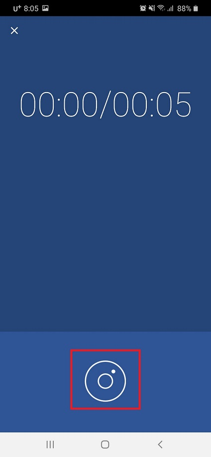
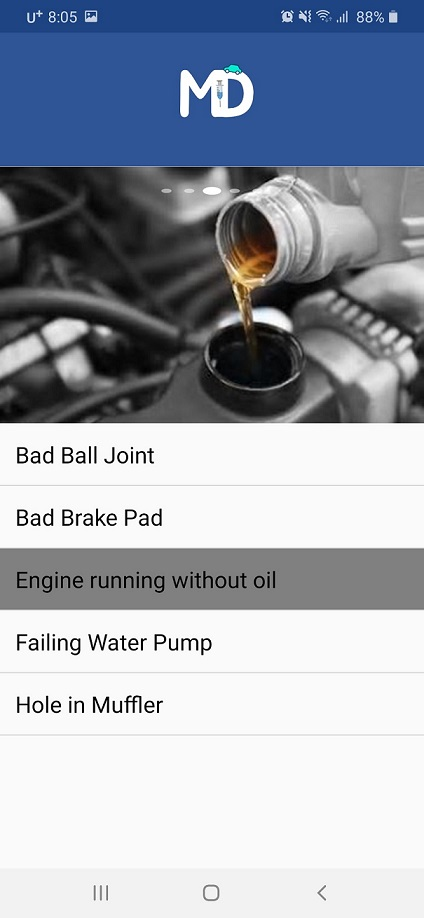

# Sound-mechanic

# Problem
There were over 275 million cars on the road in the U.S in 2019 with an average age of 11.8 years old.
Cars being to show more issues as they age. Many car owners are not mechanics and must bring their cars into an auto shop to diagnose these issues and have them fixed. Many seasoned mechanics can easily identify car issues when a car makes an unusual sounds. We want to provide car owners the ability to identify their car issues by sound without the help of a mechanic so that the car owner can use that information to get better repair quotes or to consider fixing the issue on their own.

# Objective
The objective is to build a service that can help car owners identifier car issues when their car makes unusual noises. This service should be an andriod app that will allow users to record a car sound, upload the sound to a server, and have that sound classified into the proper issue. The following list of car sounds should be supported for classification:
  * Bad Ball Joint
  * Bad Brake Pad
  * Engine Seizing Up
  * Failing water pump
  * Hole in muffler
  * No Problem

# Tasks
## Machine Learning
  * For each car sound, download as much as possible from youtube containing each sound
  * Extract the portion of audio from each video that is the car sound and export it as a wav
  * Convert each wav file into a [**mel - spectrogram**](https://towardsdatascience.com/getting-to-know-the-mel-spectrogram-31bca3e2d9d0) image
  * Split data into training, validation and test set
  * Create a classifier for the images of the car sounds
  * Try data augmentation
  * Try different architectures
  * Make classifier as a web service
  * Track use of classifier
     
## User interface
[MD-Android](https://github.com/jihye-kim11/MD_Mobile)

      
   click diagnose button   
      
      
   record engine sound   
      
   
   result   
   

   

      
      
## Used Library
 * pytorch
 * Fast.ai
 * pytube
 * librosa
 * pydub

## Flowchart

 * server: Flask
 * web: html
 * App: android studio(java)
 * DB: MySQL

